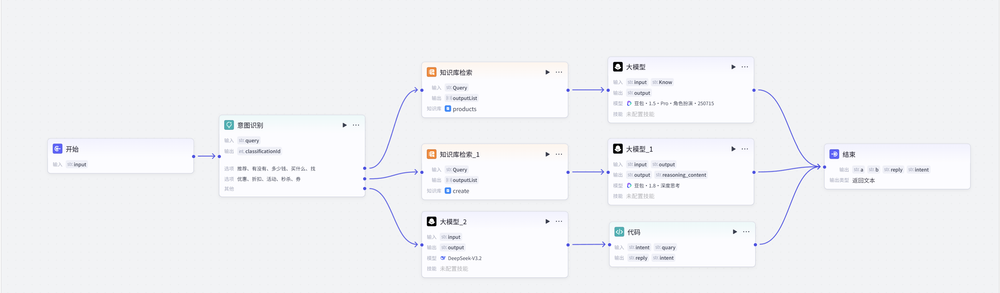

# Ask 工作流说明

## 工作流截图



## 关键节点说明

### 1. 意图识别

**输入**：开始（input）

**意图匹配**：
- （1）推荐、有没有、多少钱、买什么、找
- （2）优惠、折扣、活动、秒杀、券

### 2. 知识库检索

**输入**：开始（input）

**知识库来源**：自己搭建的coze知识库

**说明**：知识库检索的目标知识库是product知识库，知识库检索_1的目标知识库是create知识库。

### 3. 大模型_2_

**输入**：开始（input）

**Prompt**：根据用户的问题{{input}}的含义，返回"退货、退款、发货、物流、客服、售后 "中的一个词

### 4. 大模型

**输入**：开始（input），知识库搜索（know）

**Prompt**：你是一位商品选择和精通推荐文案的高手，现在你需要根据用户的问题{{input}}和知识库链接{{Know}}，。分析出最符合用户要求的方案和整理出符合用户要求的商品，最后输出推荐文案+链接

### 5. 大模型_1

**输入**：开始（input），知识库搜索_1(output)

**Prompt**：用户向你询问了折扣等等活动{{input}}，你需要根据知识库返回的内容{{output}}耐心的向用户这些活动

### 6. 代码

**输入**：大模型_2_（intent）【大模型2的output】，开始（quary)【开始节点的input】

**代码内容**：

```python
import json
async def main(args):
 params = args.params
 intent = params.get("intent", "").strip()

policies = {
    "退货": (
        "📦 **退换货政策**\n\n"
        "✅ 签收后7天内，商品完好可无理由退换\n"
        "✅ 质量问题15天内包退包换，运费商家承担\n"
        "✅ 非质量问题退回运费由买家承担\n"
        "❌ 已拆封数码产品（耳机、鼠标等）不支持退换\n"
        "💰 退款时效：退货签收后1-3个工作日原路退回\n\n"
        "👉 申请方式：「我的」→ 对应订单 →「申请售后」"
    ),
    "物流": (
        "🚚 **物流配送**\n\n"
        "📦 发货时间：下单后24小时内发货（工作日）\n"
        "🚛 合作快递：中通、圆通、顺丰\n"
        "⏱️ 配送时效：江浙沪1-2天 / 其他3-5天 / 偏远5-7天\n"
        "🔍 物流查询：「我的」→ 对应订单 →「查看物流」\n"
        "📮 快递丢件：联系客服 → 48小时内补发或退款"
    ),
    "客服": (
        "📞 **联系客服**\n\n"
        "💬 在线客服：「我的」→「联系客服」\n"
        "🕘 服务时间：9:00 - 22:00\n"
        "📋 非工作时间请留言，次日优先处理"
    ),
    "支付": (
        "💳 **支付方式**\n\n"
        "支持：微信支付、支付宝、银行卡\n"
        "不支持：货到付款、分期付款\n"
        "⚠️ 全程HTTPS加密，不存储银行卡信息"
    ),
    "优惠": (
        "🎫 **当前优惠活动**\n\n"
        "🔰 新人专享券：满99元减15元（首次注册自动发放）\n"
        "🏷️ 店铺满减：满199元减30元（结算自动抵扣）\n"
        "📦 全场包邮：所有商品无需凑单\n"
        "👥 邀请有礼：邀请1位新用户注册 → 得5元无门槛券"
    ),
    "其他": (
        "你好！我是校园商城AI导购助手~ 可以帮你解答：\n\n"
        "🛍️ 商品推荐 / 价格查询\n"
        "📦 退换货 / 物流查询\n"
        "🎫 优惠活动 / 领券\n"
        "💬 联系客服\n\n"
        "请描述你遇到的问题，我来帮你~"
    )
}

reply = policies.get(intent, policies["其他"])

return {
    "reply": reply,
    "intent": intent
}
```
